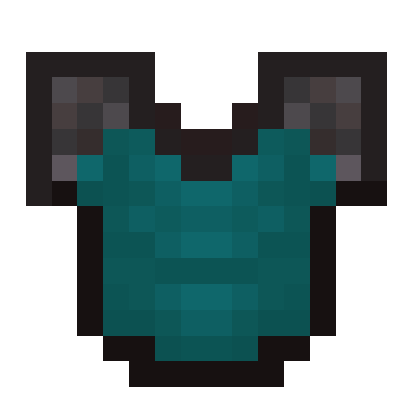

# Dyetherite

[>> Downloads <<](https://github.com/Boundarybreaker/Dyetherite/releases)

*Gearing up in style!*

**This mod is open source and under a permissive license.** As such, it can be included in any modpack on any platform without prior permission. We appreciate hearing about people using our mods, but you do not need to ask to use them. See the [LICENSE file](LICENSE) for more details.

Dyetherite allows you to dye Netherite armor just like leather. All damage, enchantments, names, and other NBT will be preserved when dyeing or cleaning.